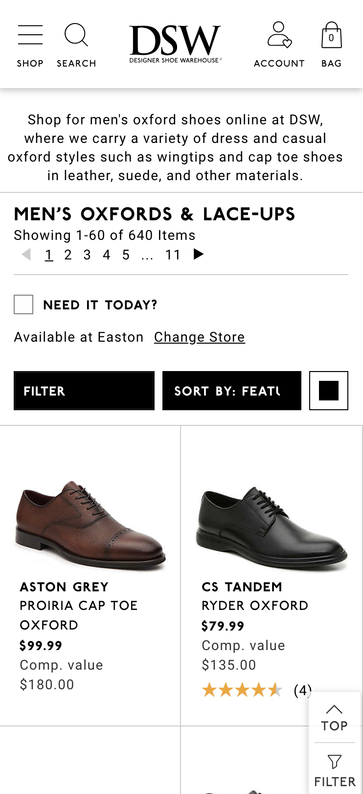
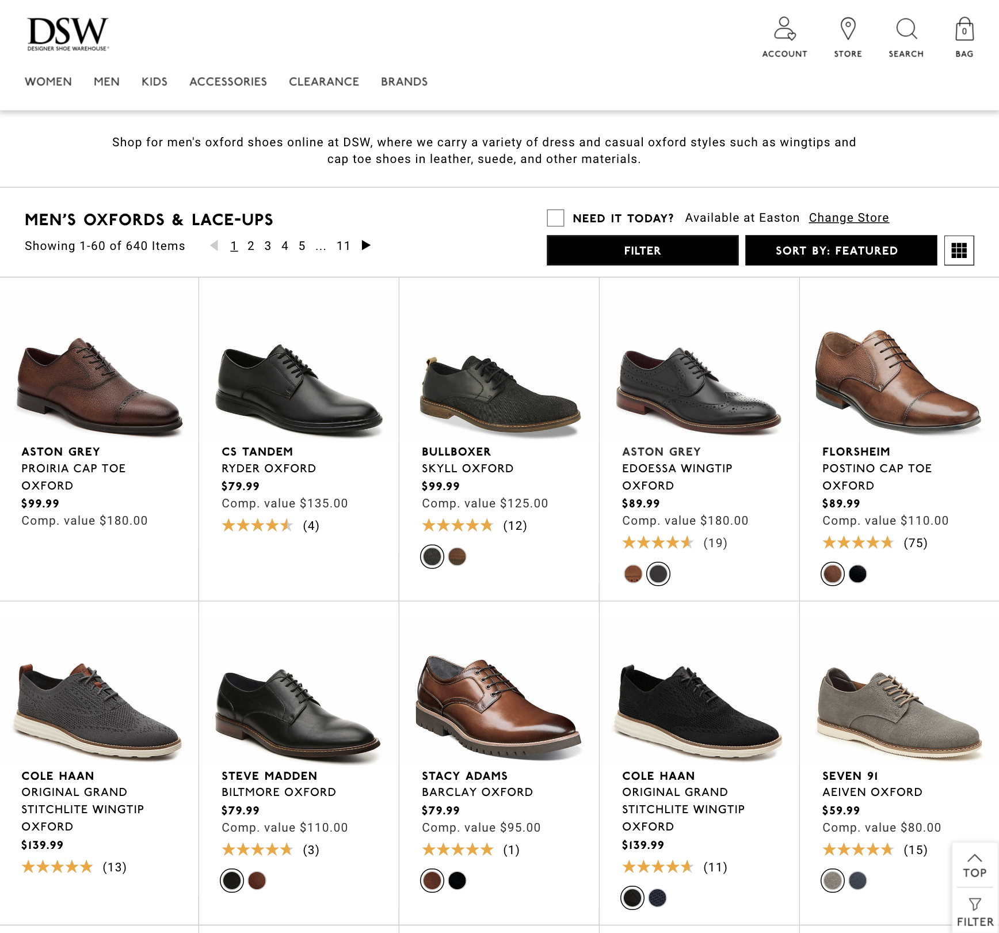

# DSW Interview Assessment Project
The goal of this project should be to create a single HTML page (index.html) that resembles the simplified DSW collection page concepts below as best you can.  You can choose to code a static or dynamic page.

<h2>Guidelines</h2>
<ul>
  <li>There is a products.json file that contains data from 10 products that should be output on the collection page.</li>
  <li>There are images for the navigation icons, logo, and products.</li>
  <li>DSW use AngularJS 1.6, but will be upgrading to Angular 8.</li>
  <li>DSW uses BEM for SASS/CSS</li>
</ul>

You can visit the <a href="https://www.dsw.com/en/us/category/mens-oxfords/N-1z141hwZ1z128urZ1z141ju?No=0" target="_blank">actual DSW.com collection page</a> to look at hover and state behaviors.

<h2>Submission Instructions</h2>
<ol>
  <li>Respond back to email with GitHub ID.</li>
  <li>Create a new branch (assessment/{lastname-firstname} and commit to origin.</li>
  <li>Create a PR from above branch to master.</li>
</ol>

<h2>Layouts to Implement</h2>

  <h3>Mobile</h3>
  
For DSW, this view goes to 767px

  

    <h3>Desktop</h3>
   

Happy Coding!

The DSW UI Team
